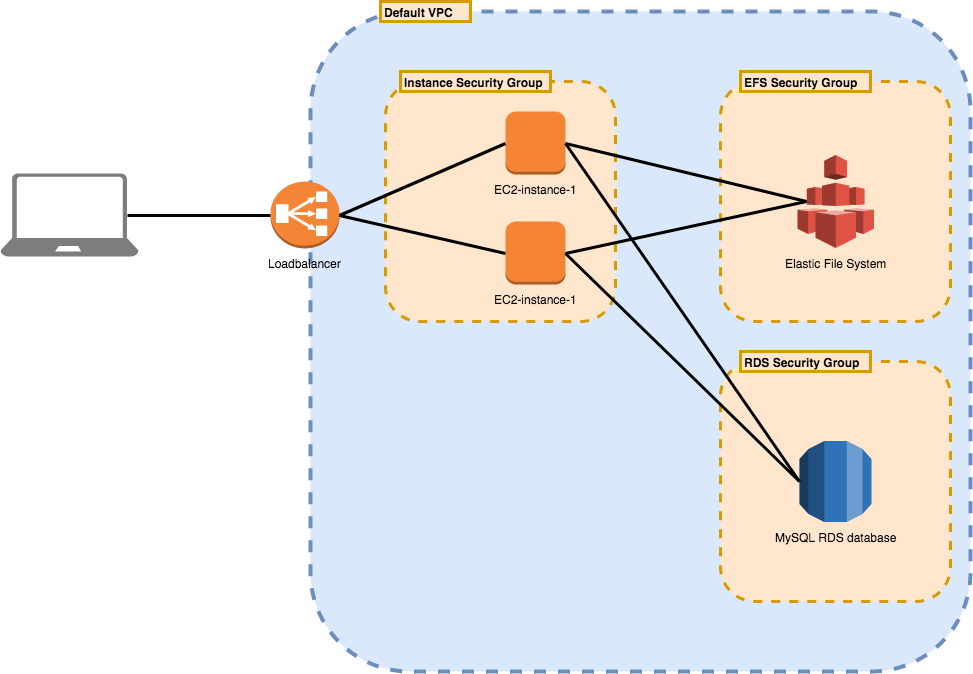

# High available drupal with RDS database
## Environment

The goal of this lab is to set up a high available drupal setup that uses an Elastic File System and an Amazon Relational Database Service.

## Technologies

1. EC2 instances
    * [EC2 Documentation](https://docs.aws.amazon.com/ec2/index.html?id=docs_gateway#lang/en_us)
1. Elastic File System (EFS)
    * [EFS Documentation](https://docs.aws.amazon.com/efs/index.html?id=docs_gateway#lang/en_us)
1. Amazon Relational Database Service (RDS)
    * [RDS Documentation](https://docs.aws.amazon.com/rds/index.html?id=docs_gateway#lang/en_us)

## Configuration Steps

1. Configure EFS

    1. Services
    1. EFS
    1. Click `Create file system`
    1. Click `Next Step`
    1. Add a value for the name tag e.g. `drupal-efs-<yourID>`
    1. Click `Next Step`
    1. Click `Create File System`  

1. Configure RDS

    1. Click `Create database`
    1. Choose `MySQL`
    1. Click `Next`
    1. For this usecase we will use `Dev/Test - MySQL` choose this option
    1. Click `Next`
    1. Scroll down to `Settings` and fill in the textboxes `DB instance identifier`, `Master username`, `Master password` and `Confirm password`
    1. Click `Next`
    1. In advanced settings we will only define the name of the database. This is the name we later need in the Drupal configuration
    1. Click `Create database`

1. Deploy instances

    1. Services
    1. EC2
    1. Click `Launch Instance`
    1. Choose for the `Ubuntu Server 16.04 LTS` image
    1. Click `Next: Configure Instance Details`
    1. Click `Next: Add Storage`
    1. Click `Next: Add Tags`
    1. Use the `Name` tag to give the instance a name `Efs-instance-1-<yourID>`
    1. Click `Next: Configure Security Group`
    1. Use the name `workshop-sg-<yourID>` and add an SSH rule and HTTP rule for us to be able to use the `EFS` we also need to add the `NFS` rule with the source being the security group of the shared filesystem
    1. The `nfs-common` tools need to get installed

        1. `sudo apt-get update && sudo apt-get dist-upgrade && sudo apt-get autoremove`
        1. `sudo apt-get install nfs-common -y`

    1. Install apache2

        1. `sudo apt-get install apache2`
        1. `sudo systemctl stop apache2`
        1. `sudo systemctl start apache2`
        1. `sudo systemctl enable apache2`

    1. Mount the `EFS` on your `EC2-instance`

        1. `sudo mount -t nfs4 -o nfsvers=4.1,rsize=1048576,wsize=1048576,hard,timeo=600,retrans=2,noresvport <EFS-DNS-name>:/ /var/www/html`

    1. Install Drupal

        1. `sudo apt-get install php libapache2-mod-php php-mysql php-xml php-mysql php-curl php-gd php-imagick php-imap php-mcrypt php-recode php-tidy php-xmlrpc`
        1. `cd /var/www/html`
        1. `sudo wget ftp.drupal.org/files/projects/drupal-8.3.5.tar.gz`
        1. `sudo tar xzvf drupal*`
        1. `sudo mv ./drupal-8.3.5/* .`
        1. `sudo rm -rf durpal-8.3.5`
        1. `sudo rm -rf durpal-8.3.5.tar.gz`
        1. `sudo cp /var/www/html/sites/default/default.settings.php /var/www/html/sites/default/settings.php`
        1. `sudo rm -rf /var/www/html/index.html`
        1. `sudo chmod -R 755 /var/www/html/*`
        1. `sudo chown -R www-data:www-data /var/www/html/*`
        1. `sudo a2enmod rewrite`
        1. `sudo a2enmod env`     
        1. `sudo a2enmod dir`
        1. `sudo a2enmod mime`
        1. `sudo vi /etc/apache2/sites-enabled/000-default.conf` and add the following content, some things might already be there. Check if these configurations are correct too.

                <VirtualHost *:80>

                ServerAdmin admin@example.com
                DocumentRoot /var/www/html/
                ServerName example.com
                ServerAlias www.example.com
                ErrorLog ${APACHE_LOG_DIR}/error.log
                CustomLog ${APACHE_LOG_DIR}/access.log combined

                <Directory /var/www/html/>
                     Options FollowSymlinks
                     AllowOverride All
                     Require all granted
                </Directory>
                <Directory /var/www/html/>
                     RewriteEngine on
                     RewriteBase /
                     RewriteCond %{REQUEST_FILENAME} !-f
                     RewriteCond %{REQUEST_FILENAME} !-d
                     RewriteRule ^(.*)$ index.php?q=$1 [L,QSA]
                </Directory>

                </VirtualHost>        

        1. `sudo systemctl restart apache2`

    1. Configure security groups

        1. We want to connect to a remote database, therefore we need to add the `MYSQL` inbound rule to our `EC2-instance security group` we also need to be able to send traffic, for this usecase we are going to let all traffic pass to the database from the `EC2-instance security group`

    1. Configure Drupal

        1. Browse to the external IP of the EC2-instance
        1. Follow the drupal setup, on the `Set up database` step be sure to add the name of the remote DB, the master user and password. In advanced settings use the DB endpoint that you can find in the DB tab of the AWS environment
        1. In the last step of the Drupal installation please fill in the required textboxes and click `Save and Continue` the Drupal site will now be deployed

    1. Deploy a second `EC2-instance` and execute the following commands. We won't do all the commands from the first instance, this because we will use the already configured `EFS filesystem` with most of the configurations of drupal on it

        1. `sudo apt-get update && sudo apt-get dist-upgrade && sudo apt-get autoremove`
        1. `sudo apt-get install nfs-common -y`
        1. `sudo apt-get install apache2`
        1. `sudo systemctl stop apache2`
        1. `sudo systemctl start apache2`
        1. `sudo systemctl enable apache2`
        1. `sudo mount -t nfs4 -o nfsvers=4.1,rsize=1048576,wsize=1048576,hard,timeo=600,retrans=2,noresvport <EFS-DNS-name>:/ /var/www/html`
        1. `sudo apt-get install php libapache2-mod-php php-mysql php-xml php-mysql php-curl php-gd php-imagick php-imap php-mcrypt php-recode php-tidy php-xmlrpc`
        1. `sudo a2enmod rewrite`
        1. `sudo a2enmod env`     
        1. `sudo a2enmod dir`
        1. `sudo a2enmod mime`
        1. `sudo vi /etc/apache2/sites-enabled/000-default.conf`
        1. Paste the same configurations in this config file, you can find this a few steps back
        1. `sudo systemctl restart apache2`

    1. Configure Loadbalancer

        1. Services
        1. EC2
        1. Load Balancers
        1. Click `Create Load Balancer`
        1. Click `Create` underneath the Application Load Balancer
        1. Name your Loadbalancer
        1. Choose 2 availability zones
        1. Click `Next: Configure Security Settings`
        1. Click `Next: Configure Security Groups`
        1. You can choose an existing security group or make a new one with the HTTP rule enabled
        1. Click `Next Configure Routing`
        1. Name a new target groupo
        1. Click `Next: Register Targets`
        1. Highlight the targets you want to add, click `Add to registered`
        1. Click `Next: Review`
        1. Click `Create`
        1. Click `Close`
        1. Now copy the `DNS name` and you can browse to the Loadbalancer and he will take care of the loadbalancing between the instances.
        1. You can add this as an `A record` to you hosted zone to be able to browse to e.g. `my.loadbalancer.domain.name`

## Recap

In this lab we made a deployment of Drupal on two instances. We used a shared filesystem for the deployment, whenever something changes it gets updated on both of the servers. We used an RDS database that both the instances share and deployed a Loadbalancer in front of the environment. The Loadbalancer will make sure that your environment is available if there is a minimum of one healthy instance.
