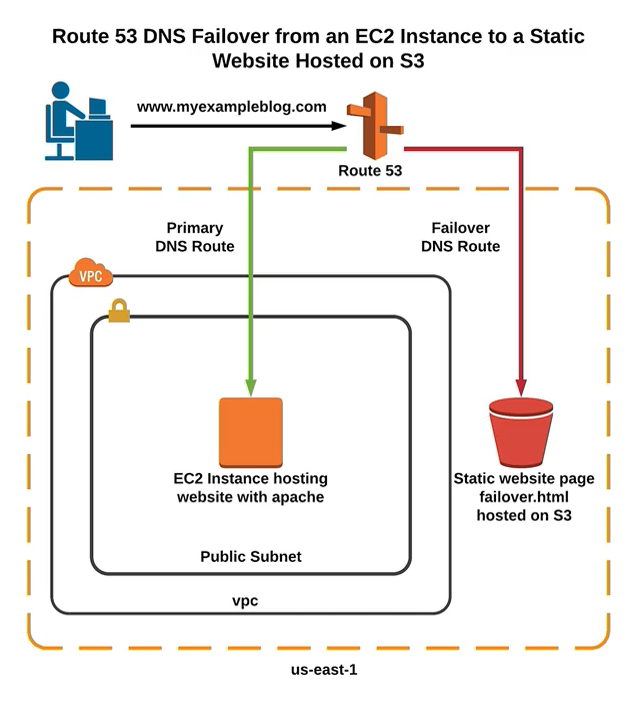

# Route 53 DNS failover from EC2 to S3 bucket
## Environment

## Technologies

1. EC2 Instances
    * [EC2 Documentation](https://docs.aws.amazon.com/ec2/index.html?id=docs_gateway#lang/en_us)
1. S3 Bucket
    * [S3 Documentation](https://docs.aws.amazon.com/s3/index.html?id=docs_gateway#lang/en_us)
1. Route 53
    * [Route 53 Documentation](https://docs.aws.amazon.com/route53/index.html?id=docs_gateway#lang/en_us)
1. Apache
    * [Apache Documentation](https://httpd.apache.org/docs/)
1. Linux
    * [Ubuntu Documentation](https://help.ubuntu.com/lts/serverguide/)

## Configuration Steps

1. Configure EC2 instance

    1. Services
    1. EC2
    1. Launch Instance
    1. Pick Image `Ubuntu Server 16.04 LTS - ami-c7ab5fa0`
    1. Click `Next: Configure Instance Detail`
    1. Click `Next: Add Storage`
    1. Click `Next: Add Tags`
    1. Optional: you can add a name tag here
    1. Click `Next: Configure Security Group`
    1. Configure a new security group
        1. Give the new security group a proper name `Workshop-<yourID>-SG`
        1. You will see that there's a standard SSH rule already in the SG, If you want to secure this rule put the source on `My IP`
        1. Add a new rule `http` and this can be accessed from everywhere
    1. Click `Next: Review and launch`  
    1. Make sure your configurations are correct and click `Launch`
    1. Create a new keypair and download it, make sure to keep this in a secure place since this is the key to your webserver
    1. Press `view instances` and you will see your server spawning  

1. Install apache on EC2 instance

    1. When your instance is up and running use the SSH key to access the machine this can be done with `putty` on windows or a `terminal` on `linux / mac`
    1. `ssh -i <keyfile> ubuntu@yourinstanceIP`
    1. Use the following command to update the new instance `sudo apt-get update`
    1. Install apache with the following command `sudo apt-get -y install apache2`
    1. Check if the apache service is running by running the command `systemctl status apache2` or you can browse to the public IP address of your instance. If you configured everything correctly you should see the default apache page on that address

1. Create index.html

    1. Go to /var/www/html `cd /var/www/html`  
    1. Backup the default page to index.html_old with `sudo mv index.html index.html_old`
    1. Create a new index.html with your favorite text editor, we will use vi `sudo vi index.html`fill this file with custom HTML code, for example : `<h1>Welcome to my website.</h1>`  

1. Create Health Check

    1. Services
    1. Route 53
    1. Health Checks
    1. Name the health check whatever you like e.g. `workshop-<yourID>-HC`
    1. Click `Next`
    1. Click `Create Healthcheck`

1. Create Route 53 record set with IP of instance and preferred domain name

    1. Services
    1. Route 53
    1. Hosted zones
    1. Choose the correct zone
    1. Create record set
    1. Create an `A` record and lookup the public IP of your instance
    1. In the tab `Routing Policy` choose the option `Failover` and use the `Primary` Failover Record type
    1. Click `Yes` in the `Associate with Health Check` tab and choose the Health Check we created in the previous step
    1. Click `create`
    1. Now we will have to wait a moment for the rule to kick in. When the DNS is updated we will be able to browse to the address we just created. For my example this will be `workshop.example.gluo.io`

1. Create Static Bucket (everyone read access --> webpage)

    1. Services
    1. S3
    1. Create bucket
    1. Enter a bucket name this will be  `workshop.example.gluo.io` for our environment
    1. Click `next`
    1. Click `next`
    1. Choose `Grant public read access to this bucket` in the section `Manage Public Permissions`
    1. Click `next`
    1. Click `Create bucket`
    1. Upload the `error.html` and `index.html` files from this example to the bucket. It's obviously also possible to create your own `index.html` and `error.html` files
    1. Click `Next`
    1. Choose `Grant public read access to this bucket` in the section `Manage Public Permissions` this will provide access to the files, this is needed to get access to the website
    1. Click `Upload`
    1. Configure the bucket to host a static website
        1. Click on `Properties`
        1. Click on `Static website hosting`
        1. Choose `Use this bucket to host a website`
        1. Insert the correct filenames in the `index.html` and `error.html` textbox
        1. Click `Save`
        1. If you click back on `Static website hosting` you will see that we now have an endpoint for the bucket, try to browse to this endpoint to check if you configured everything correct

1. Route 53 s3 endpoint (Alias) --> failover (record type : secondary)

    1. Services
    1. Route 53
    1. Create new record
    1. Use the domain name for a new `A` record. In our example this is `workshop.example.gluo.io`
    1. For this record we will use an alias instead of an IP address. If you named your bucket correctly it should pop up when you use the dropdown at `Alias Target`
    1. We choose for `Failover` at the `Routing Policy` and choose the `Secondary` Failover Record Type

1. Test the setup by stopping the `EC2 instane` you have created at the start. If you now wait for 3-5 minutes and browse to the url e.g. `workshop.example.gluo.io` you will see that you now get the page that is hosted in the S3 bucket.

## Recap

In this Lab we learned to create an `EC2 instance` that hosts a website. Along with this webserver we created an `S3 Bucket` that hosts a static website, using `Route 53` we made it possible for the environment to use a failover to the `S3 Bucket`. Whenever our `EC2 instance` stops or crashes we will be redirected to the `S3 Bucket`.
